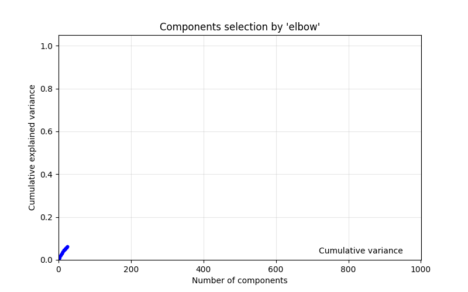

# BEIR-Latent-methods-Exploration
This academic project explores **classical Information Retrieval (IR)** using the [BEIR benchmark](https://github.com/beir-cellar/beir), as a small extension of
an undergraduate work at university Paris Cité.
I implemented **BM25 and Latent Semantic Analysis (LSA)** and experimented with a **Rocchio *Pseudo Relevance Feedback* (PRF)**, built on a **zero-shot LSA with heuristically selected k components**.

The goal was to explore whether it was possible to automatically find a good trade-off in the number of LSA components, maintaining a sufficient retrieval quality while 
avoiding a big computation time and memory cost. It also aimed to explore query expansion by experimenting a Rocchio PRF algorithm directly in the semantic space (https://en.wikipedia.org/wiki/Rocchio_algorithm), as it is possible to automatically get positive and negative feedback from a subset of similar documents. 

---

## Objectives
- Reproduce **classical baselines** (BM25, LSA).  
- Study the impact of **dimensionality reduction (LSA)** with heuristacally k component selected.
- Explore if **query expansion (Rocchio pseudo relevance feedback)** can improve retrieval in semantic space.
- Evaluate methods on **NFCorpus, SciDocs, ArguAna, Scifact**  BEIR datasets.  

---

## Methods
- **BM25**: A well known and classical strong bag-of-words ranking function.  
- **LSA**: Projects a TF-IDF matrix into a latent semantic space by reducing dimensions by *Singular Value Decomposition*.
- **Zero-shot LSA**: The number of component *k* is heuristically selected via the elbow method on a prefit SVD variance curve (see GIF below).
- **Rocchio feedback**: Modifies query vectors by shifting towards top-ranked documents (positive feedback) and away from bottom ones (negative feedback). 
 

Metrics used:
- **nDCG@10** : ranking quality  
- **Recall@100** : coverage of relevant documents  

### Heuristic dimensionality (Elbow method)

To select a good trade-off for the number of latent components (k), balancing retrieval performance and computational cost,
a prefit SVD is computed on 1000 components, and the elbow point is detected mathematically from the cumulative explained variance curve.

---

## Results

### nDCG@10
| Dataset           |   BM25  |  LSA   | LSA + PRF |        
|-------------------|------|--------|-----------|
| NFCorpus          | 0.304 | **0.310** | 0.303 |
| Scidocs           | **0.145** | 0.083 | 0.084 |
| Arguana           | 0.436 | **0.516** | 0.499 |
| Scifact           | **0.607** | 0.473 | 0.429 |

### Recall@100
| Dataset           |  BM25  |  LSA   | LSA + PRF |
|-------------------|--------|--------|-----------|
| NFCorpus          | 0.235 | 0.307 | **0.313** |
| Scidocs           | **0.348** | 0.298 | 0.301 |
| Arguana           | 0.962 | 0.987 | **0.989** |
| Scifact           | 0.874 | **0.843** | 0.837 |

---

## Interpretation of Results

**BM25** remains a strong lexical baseline across all datasets, confirming its robustness.  

**LSA** performs competitively or even better than BM25 on smaller or more homogeneous corpora (*ArguAna*), where the topic structure is simple.  
However, it underperforms significantly on large and heterogeneous datasets such as *SciDocs*, where the vocabulary is vast and specialized, leading to a very sparse TF-IDF matrix and limited generalization from linear latent dimensions.  The effectiveness of **LSA also depends on query phrasing**; when queries lack lexical overlap with relevant documents, semantic projection alone is insufficient.

Another important result is that by estimating *k* with the cumulative explained variance from a 1000 components prefit, the elbow occurs on all dataset around 300 - 330 components. It can be explained by the properties of TF-IDF matrix where the singular values drop because of the law of Zipf. Most of the meaningful variance is captured by the first few hundred dimensions; selecting around 300 components by default could show very similar results as those previously observed, while saving significant computing time and memory. 

The **Rocchio PRF** slightly improves recall on some datasets (*NFCorpus*, *ArguAna*) but has marginal or negative effects on others and never surpasses the other tested models in precision. This suggests that while PRF helps densify local semantic neighborhoods, it can also add noise and fails to catch the best documents. 
In latent space, the PRF tends to **fail at reliably shifting the query** vector toward truly relevant documents, being **too dependant on the initial ranking**, making it a too naive method or simply unadapted with the zero-shot LSA experimented. 

The experiments show that a *zero-shot LSA* using a heuristically chosen *k* components underperforms compared to a **classical empirically tuned LSA** configured on each individual corpora.
